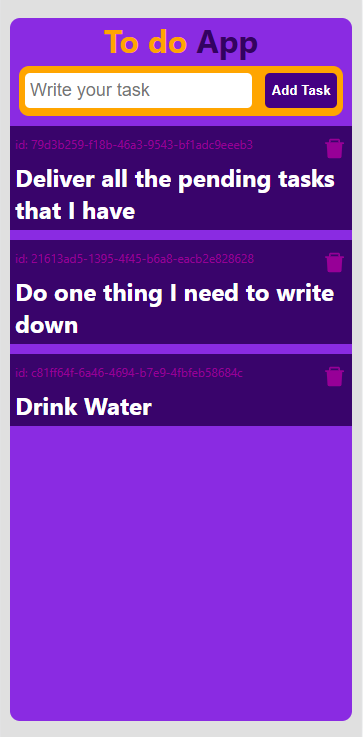
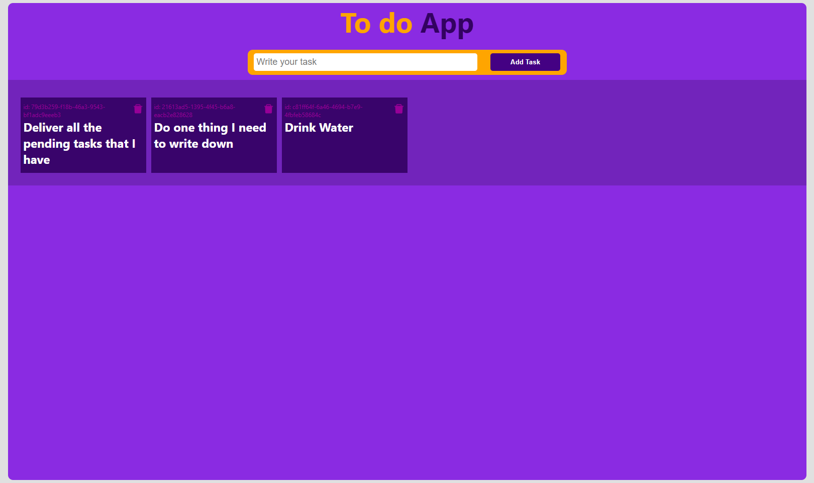

# Application to write down tasks to do
An application to document the tasks that I must carry out 
Try this project <a target='_blank' href='https://javierhuebra.github.io/note-app'>HERE</a>
# Responsive format

	
	

# Tools used
- React.js
- UUID library
- react-icons
- Typical basics of html, js and css

# Context
This app is to be able to migrate it and perform it soon with redux toolkit
